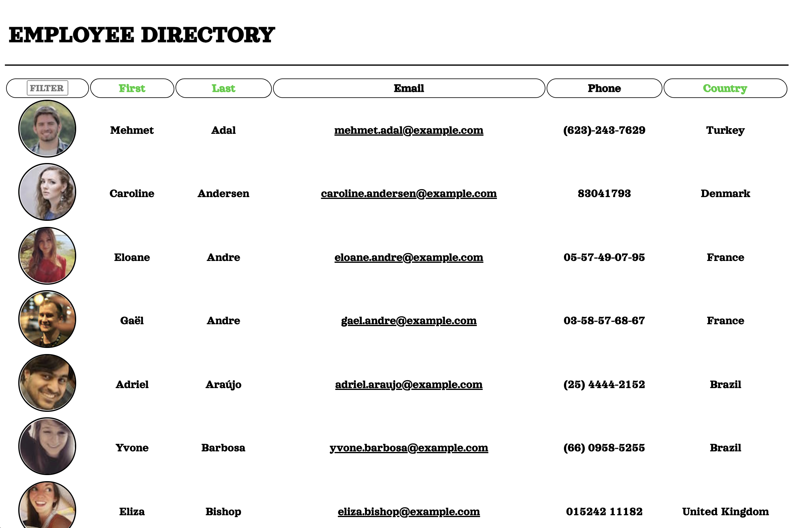

# REACT-EMPLOYEE-DIRECTORY

## About

A employee directory which utilizes React. Application loads with a random list of one hundred employees sourced from the Random User API. Employees are sortable by first name, last name and country. Employees can be filtered by name, entered in the input on the upper left. 

## Screenshot

## Deployment

[Deployment](https://paulndrwjeffrey.github.io/REACT-EMPLOYEE-DIRECTORY/)